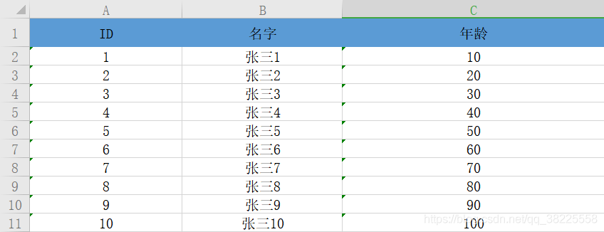
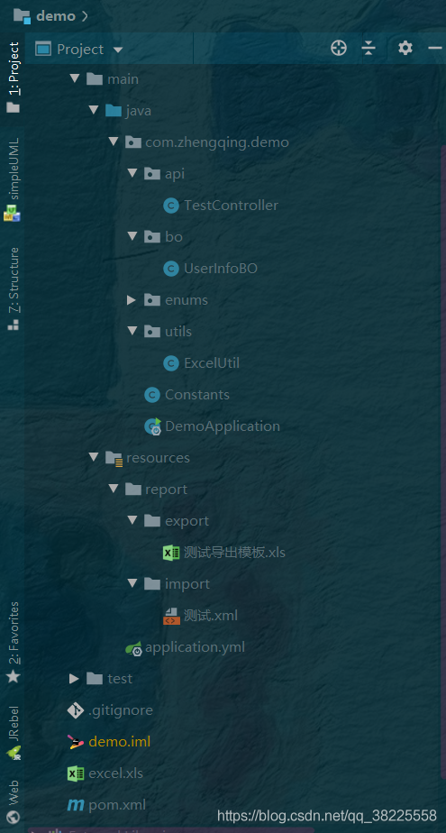

### 一、前言

1. jxls官网：[http://jxls.sourceforge.net/](http://jxls.sourceforge.net/)
2. 本文将基于`springboot2.3.3.RELEASE`去整合`jxls`实现excel导入导出功能



### 二、SpringBoot整合JXLS实现Excel导入导出

#### 1、`pom.xml`中引入相关依赖

```xml
<!-- jxls导出导入读取excel报表 -->
<!-- https://mvnrepository.com/artifact/org.jxls/jxls -->
<dependency>
  <groupId>org.jxls</groupId>
  <artifactId>jxls</artifactId>
  <version>2.8.1</version>
</dependency>
<!-- https://mvnrepository.com/artifact/org.jxls/jxls-poi -->
<dependency>
  <groupId>org.jxls</groupId>
  <artifactId>jxls-poi</artifactId>
  <version>2.8.1</version>
</dependency>
<!-- https://mvnrepository.com/artifact/org.jxls/jxls-jexcel -->
<dependency>
  <groupId>org.jxls</groupId>
  <artifactId>jxls-jexcel</artifactId>
  <version>1.0.9</version>
</dependency>
<!-- https://mvnrepository.com/artifact/org.jxls/jxls-reader -->
<dependency>
  <groupId>org.jxls</groupId>
  <artifactId>jxls-reader</artifactId>
  <version>2.0.6</version>
</dependency>
```

#### 2、Excel导入导出工具类

```java
import cn.hutool.core.io.FileUtil;
import com.zhengqing.demo.Constants;
import com.zhengqing.demo.enums.ExcelExportFileTypeEnum;
import com.zhengqing.demo.enums.ExcelImportFileTypeEnum;
import java.io.File;
import java.io.FileInputStream;
import java.io.FileOutputStream;
import java.io.IOException;
import java.io.InputStream;
import java.io.OutputStream;
import java.net.URLEncoder;
import java.util.HashMap;
import java.util.List;
import java.util.Map;
import javax.servlet.http.HttpServletResponse;
import lombok.SneakyThrows;
import lombok.extern.slf4j.Slf4j;
import org.apache.poi.ss.usermodel.Workbook;
import org.apache.poi.ss.usermodel.WorkbookFactory;
import org.jxls.common.Context;
import org.jxls.reader.ReaderBuilder;
import org.jxls.reader.XLSReadStatus;
import org.jxls.reader.XLSReader;
import org.jxls.transform.poi.PoiTransformer;
import org.jxls.util.JxlsHelper;
import org.springframework.core.io.ClassPathResource;
import org.springframework.core.io.Resource;
import org.springframework.web.multipart.MultipartFile;

/**
 * <p>
 * 导入导出Excel报表工具类
 * </p>
 *
 * @author : zhengqing
 * @description :
 * @date : 2020/9/7 14:26
 */
@Slf4j
public class ExcelUtil {

    /**
     * 读取上传文件数据
     *
     * @param dataList:
     *            数据
     * @param excelImportFileTypeEnum:
     *            导入报表模板类型
     * @param file:
     *            上传文件数据
     * @param isThrowException:
     *            遇到错误是否抛出异常信息 true:抛出 false：不抛，继续处理数据
     * @return: 装满数据的dataList
     * @author : zhengqing
     * @date : 2020/9/7 13:59
     */
    @SneakyThrows(Exception.class)
    public static <E, T> List<T> read(List<T> dataList, ExcelImportFileTypeEnum excelImportFileTypeEnum,
        MultipartFile file, boolean isThrowException) {
        String fileName = file.getName();
        InputStream inputXLS = null;
        InputStream inputXML = null;
        try {
            Resource resource =
                new ClassPathResource(Constants.DEFAULT_REPORT_IMPORT_FOLDER + excelImportFileTypeEnum.getMappingXml());
            // 上传文件流
            inputXLS = file.getInputStream();
            // xml配置文件流
            inputXML = resource.getInputStream();
            // 执行解析
            XLSReader mainReader = ReaderBuilder.buildFromXML(inputXML);
            Map<String, Object> beans = new HashMap<>(1);
            beans.put("dataList", dataList);
            XLSReadStatus readStatus = mainReader.read(inputXLS, beans);
            if (readStatus.isStatusOK()) {
                log.debug("读取excel文件成功: 【{}】", fileName);
            }
        } catch (Exception e) {
            // ① 记录错误位置
            String errorCell = e.getMessage().split(" ")[3];
            // ② 记录错误原因
            String errorMsg = e.getCause().toString();
            String[] causeMsgArray = errorMsg.split(":");
            errorMsg = errorMsg.substring(causeMsgArray[0].length() + 2).split(":")[0];
            switch (errorMsg) {
                case "For input string":
                    errorMsg = "时间格式不正确";
                    break;
                case "Error converting from 'String' to 'Integer' For input string":
                    errorMsg = "请填写数字类型";
                    break;
                default:
                    break;
            }
            errorMsg = "读取" + fileName + "文件异常: " + errorCell + errorMsg;
            if (isThrowException) {
                throw new Exception(errorMsg);
            } else {
                log.error(errorMsg);
            }
        } finally {
            try {
                if (inputXLS != null) {
                    inputXLS.close();
                }
                if (inputXML != null) {
                    inputXML.close();
                }
            } catch (IOException e) {
                log.error("parse excel error : 【{}】", e.getMessage());
            }
        }
        return dataList;
    }

    /**
     * 导出EXCEL到指定路径
     *
     * @param dataList:
     *            数据
     * @param excelExportFileTypeEnum:
     *            导出报表模板类型
     * @param exportPath:
     *            导出路径
     * @return: 文件下载地址信息
     * @author : zhengqing
     * @date : 2020/9/7 13:59
     */
    @SneakyThrows(Exception.class)
    public static String export(List<Map<String, Object>> dataList, ExcelExportFileTypeEnum excelExportFileTypeEnum,
        String exportPath) {
        // 处理导出
        File exportFile = handleExport(dataList, excelExportFileTypeEnum, exportPath);
        String fileName = excelExportFileTypeEnum.getSheetName() + ".xls";
        // TODO 这里可以对`exportFile`做文件上传处理，然后返回一个文件下载地址 或其它业务处理...
        return exportFile.getAbsolutePath();
    }

    /**
     * 导出EXCEL给前端直接下载
     *
     * @param dataList:
     *            数据
     * @param excelExportFileTypeEnum:
     *            导出报表模板类型
     * @param exportPath:
     *            导出路径
     * @param response:
     * @return: void
     * @author : zhengqing
     * @date : 2020/9/8 14:59
     */
    @SneakyThrows(Exception.class)
    public static void export(List<Map<String, Object>> dataList, ExcelExportFileTypeEnum excelExportFileTypeEnum,
        String exportPath, HttpServletResponse response) {
        // 处理导出
        handleExport(dataList, excelExportFileTypeEnum, exportPath);

        // ======================= ↓↓↓↓↓↓ 响应给前端 ↓↓↓↓↓↓ =======================
        // 文件名 - 解决中文乱码问题
        String filename = URLEncoder.encode(excelExportFileTypeEnum.getTemplateFile().substring(1), "UTF-8");
        // 设置响应编码
        response.setCharacterEncoding("UTF-8");
        response.setContentType("application/x-download");
        response.setHeader("Content-Disposition", "attachment;filename=" + filename);
        OutputStream outputStream = response.getOutputStream();
        InputStream inputStream = new FileInputStream(exportPath);
        byte[] buffer = new byte[1024];
        int i = -1;
        while ((i = inputStream.read(buffer)) != -1) {
            outputStream.write(buffer, 0, i);
        }
        outputStream.flush();
        outputStream.close();
        inputStream.close();
    }

    /**
     * 处理导出数据逻辑
     *
     * @param dataList:
     *            数据
     * @param excelExportFileTypeEnum:
     *            导出报表模板类型
     * @param exportPath:
     *            导出路径
     * @return: 导出数据文件
     * @author : zhengqing
     * @date : 2020/9/8 15:49
     */
    @SneakyThrows(Exception.class)
    private static File handleExport(List<Map<String, Object>> dataList,
        ExcelExportFileTypeEnum excelExportFileTypeEnum, String exportPath) {
        Resource resource =
            new ClassPathResource(Constants.DEFAULT_REPORT_EXPORT_FOLDER + excelExportFileTypeEnum.getTemplateFile());
        InputStream templateInputStream = resource.getInputStream();

        log.debug("导出文件地址为:{}", exportPath);

        // 创建文件
        File exportFile = FileUtil.touch(exportPath);

        // 列表数据将存储到指定的excel文件路径
        OutputStream out = new FileOutputStream(exportPath);
        // 这里的context是jxls框架上的context内容
        Context context = PoiTransformer.createInitialContext();
        // 将列表参数放入context中
        context.putVar("dataList", dataList);
        Workbook workbook = WorkbookFactory.create(templateInputStream);
        // Changing name of the first sheet
        workbook.setSheetName(0, excelExportFileTypeEnum.getSheetName());
        PoiTransformer transformer = PoiTransformer.createTransformer(workbook);
        transformer.setOutputStream(out);
        // 将列表数据按照模板文件中的格式生成
        JxlsHelper.getInstance().processTemplate(context, transformer);
        templateInputStream.close();
        out.close();
        return exportFile;
    }

}
```

#### 3、其中全局常用变量+导入导出所需枚举类+测试业务数据类

```java
public class Constants {

    /**
     * 导入导出文件相关
     */
    public static String DEFAULT_REPORT_IMPORT_FOLDER = "/report/import";
    public static String DEFAULT_REPORT_EXPORT_FOLDER = "/report/export";

    /**
     * 系统分隔符
     */
    public static String SYSTEM_SEPARATOR = "/";

    /**
     * 获取项目根目录
     */
    public static String PROJECT_ROOT_DIRECTORY = System.getProperty("user.dir").replaceAll("\\\\", SYSTEM_SEPARATOR);

    /**
     * excel导出测试临时存储路径
     */
    public static String FILE_PATH_TEST_EXPORT_EXCEL = PROJECT_ROOT_DIRECTORY + "/excel.xls";

}
```

```java
@Getter
@AllArgsConstructor
public enum ExcelImportFileTypeEnum {

    测试("/测试.xml");

    /**
     * 导入映射文件XML
     */
    private String mappingXml;

}
```

```java
@Getter
@AllArgsConstructor
public enum ExcelExportFileTypeEnum {

    测试("/测试导出模板.xls", "测试");

    /**
     * 导出模板文件
     */
    private String templateFile;
    /**
     * 导出表格名
     */
    private String sheetName;

}
```

```java
@Data
@Builder
@NoArgsConstructor
@AllArgsConstructor
public class UserInfoBO {

    private String id;

    private String name;

    private String age;

}
```

#### 4、导出Excel模板配置


###### ① `jx:area`标识区域最后一个单元格的引用


###### ② `jx:each`标识数据循环处理


#### 5、导入Excel解析配置

```xml
<?xml version="1.0" encoding="UTF-8"?>
<workbook>
  <!-- ① 指定读取哪一个sheet： name="测试" ② 如果只是读取第一个的话，可使用： idx="0" -->
  <worksheet name="测试">
    <!-- 表头开始至结束行 -->
    <section startRow="1" endRow="1"/>
    <!--
    开始循环读取文件数据，配置开始行，items映射的list var映射的bean varType 类路径
      startRow：开始循环的行数
      endRow-startRow：循环体的大小，0代表一行，依次论推
      每循环一次，判断是否结束，不结束继续循环，直至结束
     -->
    <loop startRow="2" endRow="2" items="dataList" var="item"
      varType="com.zhengqing.demo.bo.UserInfoBO">
      <!-- 循环开始行 -->
      <section startRow="2" endRow="2">
        <!-- 循环中每一次的节点属性配置 -->
        <mapping row="2" col="0">item.id</mapping>
        <mapping row="2" col="1">item.name</mapping>
        <mapping row="2" col="2">item.age</mapping>
      </section>
      <!-- 结束条件配置 -->
      <loopbreakcondition>
        <rowcheck offset="0">
          <!-- 空白结束不填 -->
          <cellcheck offset="0"/>
        </rowcheck>
      </loopbreakcondition>
    </loop>
  </worksheet>
</workbook>
```

#### 6、测试api

```java
@Slf4j
@RestController
@RequestMapping("/api/test")
public class TestController {

    @GetMapping("/exportData")
    public void exportData(HttpServletResponse response) {
        List<UserInfoBO> userInfoList = Lists.newArrayList();
        for (int i = 1; i <= 10; i++) {
            userInfoList.add(new UserInfoBO(String.valueOf(i), "张三" + i, String.valueOf(i * 10)));
        }
        List<Map<String, Object>> dataList =
            JSON.parseObject(JSON.toJSONString(userInfoList), new TypeReference<List<Map<String, Object>>>() {});
        ExcelUtil.export(dataList, ExcelExportFileTypeEnum.测试, Constants.FILE_PATH_TEST_EXPORT_EXCEL, response);
    }

    // @PostMapping("/importData")
    @GetMapping("/importData")
    public String importData(@RequestParam(value = "file", required = false) MultipartFile file) {
        List<UserInfoBO> userInfoList = Lists.newArrayList();
        try {
            // 本地File文件转MultipartFile作临时测试前端上传文件导入数据
            File fileLocal = FileUtil.newFile(Constants.FILE_PATH_TEST_EXPORT_EXCEL);
            InputStream inputStream = new FileInputStream(fileLocal);
            MultipartFile multipartFile = new MockMultipartFile(fileLocal.getName(), inputStream);
            ExcelUtil.read(userInfoList, ExcelImportFileTypeEnum.测试, multipartFile, true);
            System.out.println(userInfoList);
        } catch (Exception e) {
            return e.getMessage();
        }
        return "SUCCESS";
    }

}
```

---


### 本文案例demo源码

[https://gitee.com/zhengqingya/java-workspace](https://gitee.com/zhengqingya/java-workspace)



--- 

> 今日分享语句：
> 学会下一次进步，是做大自己的有效法则。因此千万不要让自己睡在已有的成功温床上。
